# UML-діаграма класів - Online Cinema System

## UML-діаграма класів (Mermaid)

```mermaid
classDiagram
    %% Entities
    class User {
        -Long id
        -String username
        -String email
        -String password
        -String firstName
        -String lastName
        -Role role
        -LocalDateTime createdAt
    }
    
    class Movie {
        -Long id
        -String title
        -String description
        -LocalDate releaseDate
        -Integer releaseYear
        -String country
        -String posterUrl
        -String videoUrl
        -Integer durationMinutes
        -Double rating
        -Long viewCount
    }
    
    class Series {
        -Long id
        -String title
        -String description
        -LocalDate releaseDate
        -Integer releaseYear
        -String country
        -String posterUrl
        -Double rating
        -Long viewCount
    }
    
    class Episode {
        -Long id
        -String title
        -String description
        -Integer season
        -Integer episodeNumber
        -String videoUrl
        -Integer durationMinutes
        -Long viewCount
    }
    
    class Genre {
        -Long id
        -String name
        -String description
    }
    
    class Subscription {
        -Long id
        -SubscriptionType type
        -LocalDateTime startDate
        -LocalDateTime endDate
        -Boolean isActive
        -Double price
    }
    
    class Favorite {
        -Long id
        -LocalDateTime addedAt
    }
    
    class ViewingHistory {
        -Long id
        -LocalDateTime viewedAt
        -Long watchTimeSeconds
        -Boolean completed
    }
    
    %% DTOs
    class UserDto {
        +Long id
        +String email
        +String firstName
        +String lastName
        +String role
        +LocalDateTime createdAt
    }
    
    class MovieDto {
        +Long id
        +String title
        +String description
        +LocalDate releaseDate
        +Integer releaseYear
        +String country
        +String posterUrl
        +String videoUrl
        +Integer durationMinutes
        +Double rating
        +Long viewCount
        +Set~String~ genres
    }
    
    class SeriesDto {
        +Long id
        +String title
        +String description
        +LocalDate releaseDate
        +Integer releaseYear
        +String country
        +String posterUrl
        +Double rating
        +Long viewCount
        +Set~String~ genres
    }
    
    %% Services
    class MovieService {
        -MovieRepository movieRepository
        -GenreRepository genreRepository
        -ContentFactory contentFactory
        +findAll() List~MovieDto~
        +findById(Long) MovieDto
        +search(String) List~MovieDto~
        +findByGenre(Long) List~MovieDto~
        +findByYear(Integer) List~MovieDto~
        +findByCountry(String) List~MovieDto~
        +findByFilters(...) List~MovieDto~
        +create(MovieRequest) MovieDto
        +update(Long, MovieRequest) MovieDto
        +deleteById(Long) void
    }
    
    class SeriesService {
        -SeriesRepository seriesRepository
        -GenreRepository genreRepository
        -ContentFactory contentFactory
        +findAll() List~SeriesDto~
        +findById(Long) SeriesDto
        +search(String) List~SeriesDto~
        +create(SeriesRequest) SeriesDto
        +update(Long, SeriesRequest) SeriesDto
    }
    
    class AuthService {
        -UserRepository userRepository
        -PasswordEncoder passwordEncoder
        -JwtTokenProvider jwtTokenProvider
        -AuthenticationManager authenticationManager
        +register(RegisterRequest) UserDto
        +login(LoginRequest) AuthResponseDto
    }
    
    class SubscriptionService {
        -SubscriptionRepository subscriptionRepository
        -UserRepository userRepository
        -SubscriptionStrategyFactory strategyFactory
        +getMySubscription() SubscriptionDto
        +upgradeToPremium() SubscriptionDto
        +downgradeToFree() SubscriptionDto
    }
    
    class RecommendationService {
        -ViewingHistoryRepository viewingHistoryRepository
        -MovieRepository movieRepository
        -SeriesRepository seriesRepository
        -RecommendationSubject recommendationSubject
        +getMovieRecommendations() List~MovieDto~
        +getSeriesRecommendations() List~SeriesDto~
    }
    
    class ReportService {
        -MovieRepository movieRepository
        -SeriesRepository seriesRepository
        -SubscriptionRepository subscriptionRepository
        -ViewingHistoryRepository viewingHistoryRepository
        +generateReport() ReportDto
    }
    
    %% Controllers
    class MovieController {
        -MovieService movieService
        -ViewingHistoryService viewingHistoryService
        -SecurityUtils securityUtils
        +getAllMovies() ResponseEntity
        +getMovieById(Long) ResponseEntity
        +searchMovies(String) ResponseEntity
        +getMoviesByFilters(...) ResponseEntity
        +watchMovie(Long) ResponseEntity
    }
    
    class AuthController {
        -AuthService authService
        -UserService userService
        -SecurityUtils securityUtils
        +register(RegisterRequest) ResponseEntity
        +login(LoginRequest) ResponseEntity
        +getCurrentUser() ResponseEntity
    }
    
    class AdminController {
        -MovieService movieService
        -SeriesService seriesService
        -GenreService genreService
        -UserService userService
        +createMovie(MovieRequest) ResponseEntity
        +updateMovie(Long, MovieRequest) ResponseEntity
        +deleteMovie(Long) ResponseEntity
        +createSeries(SeriesRequest) ResponseEntity
    }
    
    %% Repositories
    class MovieRepository {
        <<interface>>
        +findAll() List~Movie~
        +findById(Long) Optional~Movie~
        +findByTitleContainingIgnoreCase(String) List~Movie~
        +findByGenreId(Long) List~Movie~
        +findByYear(Integer) List~Movie~
        +findByCountry(String) List~Movie~
        +findByFilters(...) List~Movie~
        +save(Movie) Movie
        +deleteById(Long) void
    }
    
    class UserRepository {
        <<interface>>
        +findByUsername(String) Optional~User~
        +findByEmail(String) Optional~User~
        +save(User) User
    }
    
    class SubscriptionRepository {
        <<interface>>
        +findByUserId(Long) Optional~Subscription~
        +save(Subscription) Subscription
    }
    
    %% Design Patterns
    class ContentFactory {
        <<Factory Pattern>>
        +createMovie(String, String, Integer) Movie
        +createSeries(String, String, Integer) Series
    }
    
    class SubscriptionStrategy {
        <<Strategy Pattern>>
        <<interface>>
        +canWatchWithoutAds() boolean
        +getPrice() double
    }
    
    class FreeSubscriptionStrategy {
        <<Strategy Pattern>>
        +canWatchWithoutAds() boolean
        +getPrice() double
    }
    
    class PremiumSubscriptionStrategy {
        <<Strategy Pattern>>
        +canWatchWithoutAds() boolean
        +getPrice() double
    }
    
    class SubscriptionStrategyFactory {
        <<Factory Pattern>>
        +getStrategy(SubscriptionType) SubscriptionStrategy
    }
    
    class RecommendationObserver {
        <<Observer Pattern>>
        <<interface>>
        +update(User, ViewingHistory) void
    }
    
    class RecommendationSubject {
        <<Observer Pattern>>
        -List~RecommendationObserver~ observers
        +attach(RecommendationObserver) void
        +detach(RecommendationObserver) void
        +notifyObservers(User, ViewingHistory) void
    }
    
    class GenreBasedRecommendationObserver {
        <<Observer Pattern>>
        +update(User, ViewingHistory) void
    }
    
    %% Security
    class JwtTokenProvider {
        +generateToken(Authentication) String
        +getUsernameFromToken(String) String
        +validateToken(String) boolean
    }
    
    class SecurityUtils {
        +getCurrentUserId() Long
        +getCurrentUsername() String
    }
    
    %% Relationships
    User "1" --> "0..1" Subscription : has
    User "1" --> "*" Favorite : has
    User "1" --> "*" ViewingHistory : has
    
    Movie "*" --> "*" Genre : has
    Series "*" --> "*" Genre : has
    Series "1" --> "*" Episode : contains
    
    Favorite --> Movie : references
    Favorite --> Series : references
    ViewingHistory --> Movie : references
    ViewingHistory --> Series : references
    ViewingHistory --> Episode : references
    
    MovieService --> MovieRepository : uses
    MovieService --> ContentFactory : uses
    SeriesService --> SeriesRepository : uses
    SeriesService --> ContentFactory : uses
    
    SubscriptionService --> SubscriptionStrategyFactory : uses
    SubscriptionStrategyFactory --> SubscriptionStrategy : creates
    FreeSubscriptionStrategy ..|> SubscriptionStrategy : implements
    PremiumSubscriptionStrategy ..|> SubscriptionStrategy : implements
    
    RecommendationService --> RecommendationSubject : uses
    RecommendationSubject --> RecommendationObserver : notifies
    GenreBasedRecommendationObserver ..|> RecommendationObserver : implements
    
    MovieController --> MovieService : uses
    AuthController --> AuthService : uses
    AdminController --> MovieService : uses
    
    MovieService ..> MovieDto : creates
    SeriesService ..> SeriesDto : creates
    AuthService ..> UserDto : creates
```

## Опис основних класів

### Entity Layer (Сутності)
- **User** - користувач системи
- **Movie** - фільм
- **Series** - серіал
- **Episode** - епізод серіалу
- **Genre** - жанр
- **Subscription** - підписка користувача
- **Favorite** - обраний контент
- **ViewingHistory** - історія переглядів

### DTO Layer (Data Transfer Objects)
- **UserDto, MovieDto, SeriesDto** - об'єкти для передачі даних між шарами

### Service Layer (Бізнес-логіка)
- **MovieService, SeriesService** - сервіси для роботи з контентом
- **AuthService** - сервіс автентифікації
- **SubscriptionService** - сервіс управління підписками
- **RecommendationService** - сервіс рекомендацій
- **ReportService** - сервіс звітів

### Controller Layer (REST API)
- **MovieController, AuthController, AdminController** - REST контролери

### Repository Layer (Доступ до даних)
- **MovieRepository, UserRepository, SubscriptionRepository** - репозиторії для доступу до БД

### Design Patterns
- **ContentFactory** - Factory Pattern для створення контенту
- **SubscriptionStrategy** - Strategy Pattern для типів підписок
- **RecommendationObserver/Subject** - Observer Pattern для рекомендацій

