# Use Cases Діаграма - Online Cinema System

## Use Cases Діаграма (Mermaid)

```mermaid
graph TB
    User[Користувач] --> UC1[UC1: Реєстрація]
    User --> UC2[UC2: Авторизація]
    User --> UC3[UC3: Перегляд каталогу фільмів]
    User --> UC4[UC4: Перегляд каталогу серіалів]
    User --> UC5[UC5: Пошук контенту]
    User --> UC6[UC6: Фільтрація контенту]
    User --> UC7[UC7: Перегляд фільму]
    User --> UC8[UC8: Перегляд серіалу]
    User --> UC9[UC9: Додати до обраного]
    User --> UC10[UC10: Перегляд обраного]
    User --> UC11[UC11: Отримати рекомендації]
    User --> UC12[UC12: Перегляд профілю]
    User --> UC13[UC13: Оновити профіль]
    User --> UC14[UC14: Підписатися на Premium]
    User --> UC15[UC15: Переглянути історію переглядів]
    
    Admin[Адміністратор] --> UC16[UC16: Додати фільм]
    Admin --> UC17[UC17: Додати серіал]
    Admin --> UC18[UC18: Редагувати контент]
    Admin --> UC19[UC19: Видалити контент]
    Admin --> UC20[UC20: Переглянути звіти]
    Admin --> UC21[UC21: Управління користувачами]
    Admin --> UC22[UC22: Управління жанрами]
    
    System[Система] --> UC23[UC23: Показ реклами для Free користувачів]
    System --> UC24[UC24: Запис історії переглядів]
    System --> UC25[UC25: Генерація рекомендацій]
    System --> UC26[UC26: Обчислення статистики]
    
    UC1 --> AuthService[AuthService]
    UC2 --> AuthService
    UC3 --> MovieService[MovieService]
    UC4 --> SeriesService[SeriesService]
    UC5 --> MovieService
    UC5 --> SeriesService
    UC6 --> MovieService
    UC6 --> SeriesService
    UC7 --> MovieService
    UC7 --> ViewingHistoryService[ViewingHistoryService]
    UC8 --> SeriesService
    UC8 --> ViewingHistoryService
    UC9 --> FavoriteService[FavoriteService]
    UC10 --> FavoriteService
    UC11 --> RecommendationService[RecommendationService]
    UC12 --> UserService[UserService]
    UC13 --> UserService
    UC14 --> SubscriptionService[SubscriptionService]
    UC15 --> ViewingHistoryService
    
    UC16 --> MovieService
    UC17 --> SeriesService
    UC18 --> MovieService
    UC18 --> SeriesService
    UC19 --> MovieService
    UC19 --> SeriesService
    UC20 --> ReportService[ReportService]
    UC21 --> UserService
    UC22 --> GenreService[GenreService]
    
    UC23 --> SubscriptionService
    UC24 --> ViewingHistoryService
    UC25 --> RecommendationService
    UC26 --> ReportService
```

## Детальний опис Use Cases

### UC1: Реєстрація
**Актор:** Користувач  
**Передумови:** Користувач не зареєстрований  
**Основний сценарій:**
1. Користувач вводить email, username, password
2. Система перевіряє унікальність email та username
3. Система створює нового користувача
4. Система автоматично створює FREE підписку
5. Система автоматично авторизує користувача
6. Система повертає JWT токен

**Альтернативний сценарій:**
- Email або username вже існує → повідомлення про помилку

### UC2: Авторизація
**Актор:** Користувач  
**Передумови:** Користувач зареєстрований  
**Основний сценарій:**
1. Користувач вводить username та password
2. Система перевіряє credentials
3. Система генерує JWT токен
4. Система повертає токен та інформацію про користувача

**Альтернативний сценарій:**
- Невірні credentials → повідомлення про помилку

### UC3: Перегляд каталогу фільмів
**Актор:** Користувач  
**Основний сценарій:**
1. Користувач відкриває сторінку фільмів
2. Система відображає список фільмів з постами, назвами, рейтингами
3. Користувач може переглядати деталі фільму

### UC4: Перегляд каталогу серіалів
**Актор:** Користувач  
**Основний сценарій:**
1. Користувач відкриває сторінку серіалів
2. Система відображає список серіалів з постами, назвами, рейтингами
3. Користувач може переглядати деталі серіалу та епізоди

### UC5: Пошук контенту
**Актор:** Користувач  
**Основний сценарій:**
1. Користувач вводить пошуковий запит
2. Система шукає фільми та серіали за назвою
3. Система відображає результати пошуку

### UC6: Фільтрація контенту
**Актор:** Користувач  
**Основний сценарій:**
1. Користувач вибирає фільтри (жанр, рік, країна)
2. Система застосовує фільтри
3. Система відображає відфільтрований контент

### UC7: Перегляд фільму
**Актор:** Користувач  
**Передумови:** Користувач авторизований  
**Основний сценарій:**
1. Користувач натискає "Дивитися"
2. Якщо користувач має FREE підписку → показується реклама
3. Система відображає відеоплеєр з фільмом
4. Система записує перегляд в історію
5. Система збільшує лічильник переглядів

### UC8: Перегляд серіалу
**Актор:** Користувач  
**Передумови:** Користувач авторизований  
**Основний сценарій:**
1. Користувач вибирає епізод
2. Користувач натискає "Дивитися"
3. Якщо користувач має FREE підписку → показується реклама
4. Система відображає відеоплеєр з епізодом
5. Система записує перегляд в історію
6. Система збільшує лічильник переглядів

### UC9: Додати до обраного
**Актор:** Користувач  
**Передумови:** Користувач авторизований  
**Основний сценарій:**
1. Користувач натискає "Додати до обраного" на фільмі/серіалі
2. Система додає контент до списку обраного користувача

### UC10: Перегляд обраного
**Актор:** Користувач  
**Передумови:** Користувач авторизований  
**Основний сценарій:**
1. Користувач відкриває сторінку "Обране"
2. Система відображає список обраних фільмів та серіалів

### UC11: Отримати рекомендації
**Актор:** Користувач  
**Передумови:** Користувач авторизований, має історію переглядів  
**Основний сценарій:**
1. Користувач відкриває сторінку "Рекомендації"
2. Система аналізує історію переглядів
3. Система генерує рекомендації на основі жанрів
4. Система відображає рекомендовані фільми та серіали

### UC12: Перегляд профілю
**Актор:** Користувач  
**Передумови:** Користувач авторизований  
**Основний сценарій:**
1. Користувач відкриває сторінку профілю
2. Система відображає інформацію про користувача, підписку, історію переглядів

### UC13: Оновити профіль
**Актор:** Користувач  
**Передумови:** Користувач авторизований  
**Основний сценарій:**
1. Користувач редагує дані профілю
2. Система оновлює інформацію користувача

### UC14: Підписатися на Premium
**Актор:** Користувач  
**Передумови:** Користувач авторизований, має FREE підписку  
**Основний сценарій:**
1. Користувач переходить на сторінку оплати
2. Користувач вводить дані оплати (моковано)
3. Система оновлює підписку на PREMIUM
4. Користувач отримує доступ без реклами

### UC15: Переглянути історію переглядів
**Актор:** Користувач  
**Передумови:** Користувач авторизований  
**Основний сценарій:**
1. Користувач відкриває сторінку профілю
2. Система відображає історію переглядів

### UC16: Додати фільм
**Актор:** Адміністратор  
**Передумови:** Адміністратор авторизований  
**Основний сценарій:**
1. Адміністратор заповнює форму з даними фільму
2. Система створює новий фільм
3. Система зберігає фільм в базі даних

### UC17: Додати серіал
**Актор:** Адміністратор  
**Передумови:** Адміністратор авторизований  
**Основний сценарій:**
1. Адміністратор заповнює форму з даними серіалу
2. Система створює новий серіал
3. Система зберігає серіал в базі даних

### UC18: Редагувати контент
**Актор:** Адміністратор  
**Передумови:** Адміністратор авторизований  
**Основний сценарій:**
1. Адміністратор вибирає фільм/серіал для редагування
2. Адміністратор змінює дані
3. Система оновлює контент в базі даних

### UC19: Видалити контент
**Актор:** Адміністратор  
**Передумови:** Адміністратор авторизований  
**Основний сценарій:**
1. Адміністратор вибирає фільм/серіал для видалення
2. Система видаляє контент з бази даних

### UC20: Переглянути звіти
**Актор:** Адміністратор  
**Передумови:** Адміністратор авторизований  
**Основний сценарій:**
1. Адміністратор відкриває адмін-панель
2. Система відображає звіти:
   - Найпопулярніші фільми/жанри
   - Активність користувачів
   - Доходи від підписок

### UC21: Управління користувачами
**Актор:** Адміністратор  
**Передумови:** Адміністратор авторизований  
**Основний сценарій:**
1. Адміністратор переглядає список користувачів
2. Адміністратор може видалити користувача

### UC22: Управління жанрами
**Актор:** Адміністратор  
**Передумови:** Адміністратор авторизований  
**Основний сценарій:**
1. Адміністратор переглядає список жанрів
2. Адміністратор може додати/редагувати/видалити жанр

### UC23: Показ реклами для Free користувачів
**Актор:** Система  
**Передумови:** Користувач має FREE підписку, намагається переглянути контент  
**Основний сценарій:**
1. Система визначає тип підписки користувача
2. Якщо FREE → показується рекламне відео перед контентом
3. Після реклами користувач може переглянути контент

### UC24: Запис історії переглядів
**Актор:** Система  
**Передумови:** Користувач переглядає контент  
**Основний сценарій:**
1. Система записує факт перегляду
2. Система зберігає інформацію про перегляд в базі даних

### UC25: Генерація рекомендацій
**Актор:** Система  
**Передумови:** Користувач має історію переглядів  
**Основний сценарій:**
1. Система аналізує історію переглядів користувача
2. Система визначає улюблені жанри
3. Система знаходить контент з подібними жанрами
4. Система формує список рекомендацій

### UC26: Обчислення статистики
**Актор:** Система  
**Основний сценарій:**
1. Система збирає дані про перегляди, підписки, активність
2. Система обчислює статистику
3. Система формує звіти для адміністратора

